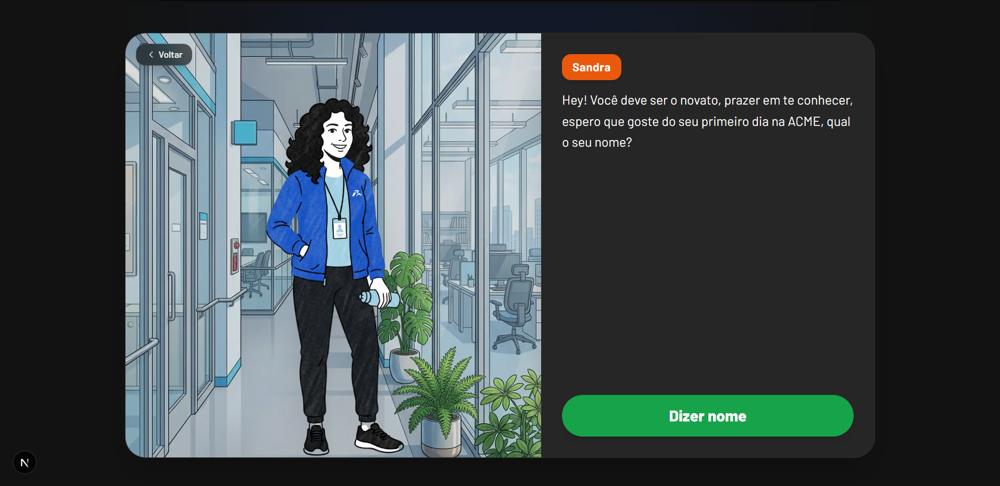

<div align="center">

</div>

<p align="center">
  <em>Aprenda Libras jogando. Pratique com propósito.</em>
</p>

<p align="center">
  <a href="https://digilibra.vercel.app" target="_blank"><strong>🎮 Jogar agora</strong></a> |
  <a href="#sobre">Sobre</a>
</p>

---

<div align="center">
  
  
  
  
</div>

---

<div align="center">
  
</div>

---

## 📖 Sobre

Digilibra é um web game imersivo que democratiza o aprendizado de Libras através da experiência interativa. Navegue pelos cenários da empresa ACME, conheça seus funcionários e principalmente **Zara**, uma colaboradora surda que será sua mentora nessa jornada.

**O diferencial:** Combinamos narrativa envolvente, desafios gamificados e prática contextualizada para tornar o aprendizado de Libras natural, divertido e significativo.

---

## ✨ Funcionalidades

- 🎮 **Gameplay Interativo**: Diálogos dinâmicos com personagens da ACME
- 👩‍💼 **Mentoria com Propósito**: Aprenda diretamente com Zara, uma profissional surda
- 📚 **Aprendizado Contextualizado**: Pratique Libras em cenários reais do cotidiano corporativo
- 🎯 **Desafios Progressivos**: Evolua em dificuldade conforme avança na história
- ♿ **Desenho Inclusivo**: Interface acessível e respeitosa com a comunidade surda
- 📱 **Responsivo**: Funciona perfeitamente em desktop, tablet e mobile

---

## 🚀 Começar a Jogar

Acesse **[digilibra.vercel.app](https://digilibra.vercel.app)** e comece sua jornada de aprendizado agora!

Não precisa de instalação ou configuração — é só clicar e jogar.

---

## 🛠️ Para Desenvolvedores

### Pré-requisitos
- Node.js 18+ instalado
- npm ou yarn

### Instalação Local

```bash
# Clone o repositório
git clone https://github.com/seu-usuario/digilibra.git
cd digilibra

# Instale as dependências
npm install
# ou
yarn install
```

### Desenvolvimento

```bash
# Inicie o servidor de desenvolvimento
npm run dev
```

Abra [http://localhost:3000](http://localhost:3000) no seu navegador para ver as mudanças em tempo real.

### Build & Deploy

```bash
# Build para produção
npm run build

# Testar build localmente
npm run start
```

O projeto é automaticamente deployado na Vercel a cada push para a branch `main`.

---

